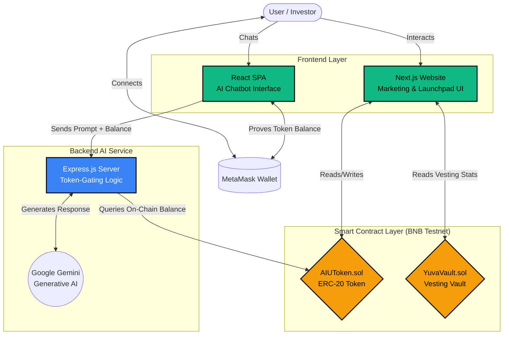

# 🚀 LPBChain

SafeLaunch AI is a robust **Web3 platform on the BNB Smart Chain (BSC) Testnet** that combines secure smart contract infrastructure—including token issuance and vesting vaults—with a token-gated AI Chatbot ecosystem.

## 🏗 System Architecture

The architecture is divided into three primary layers: **Smart Contracts**, the **AI Service Backend**, and the **User-facing Frontends**.



## ✨ Core Features

1. **AI Utility Token (AIUT)**: A fixed-supply ERC-20 token minted securely at launch on the BNB Testnet. Access to the AI features is strictly gated by the user's AIUT balance.
2. **Tiered AI Access**: The backend implements intelligent response logic based on tokens held:
   - **Tier 1 (1+ Tokens)**: Basic responses.
   - **Tier 2 (10+ Tokens)**: Standard functionality.
   - **Tier 3 (40+ Tokens)**: Advanced insights.
   - **Tier 4 (75+ Tokens)**: Maximum verbosity and expert-level AI interaction.
3. **Staircase Vesting Vault (`YuvaVault`)**: Extends OpenZeppelin’s `VestingWallet` to implement a rigid "staircase" token release schedule (e.g., 10% released per 30-day period over 10 periods), preventing sudden token dumping. Includes a multisig emergency sweep function.
4. **Dual-Frontend Architecture**:
   - A modern Next.js 16 Web3 Launchpad site built with Tailwind CSS 4 and wagmi/viem.
   - A dedicated React Single Page Application (SPA) for the token-gated AI interactions.

## 💻 Tech Stack

- **Smart Contracts**: Solidity ^0.8.20, Hardhat, OpenZeppelin v5.4, ethers.js v6
- **Web Frontend**: Next.js 16, TypeScript, Tailwind CSS 4, wagmi, viem
- **AI Chatbot Frontend**: React (CRA), ethers.js v5
- **AI Backend**: Node.js, Express, ESM, Google Generative AI (Gemini SDK)

## 🚀 Getting Started

### 1. Prerequisites
Create a `.env` file in the root directory and configure the following variables:
```env
PRIVATE_KEY="your_wallet_private_key"
MULTISIG_ADDRESS="your_multisig_address_for_vault"
```

### 2. Smart Contracts (Root)
To compile and deploy the token and vesting contracts to the BNB Testnet:
```bash
npm install
npx hardhat compile
npx hardhat run scripts/deploy.js --network bscTestnet
npx hardhat run scripts/statusAudit.js --network bscTestnet
```

### 3. Web Frontend (Next.js)
The main marketing and vault UI:
```bash
cd website
npm install
npm run dev
```

### 4. AI Chatbot Backend
The token-gated express server:
```bash
cd chatbot/server
npm install
```
Create a `chatbot/server/.env` containing:
```env
GEMINI_API_KEY="your_google_gemini_key"
GEMINI_MODEL="gemini-1.5-pro" # Optional
```
Then start the server:
```bash
npm start
```

### 5. AI Chatbot Frontend
```bash
cd chatbot/app
npm install
npm start
```

## 🔒 Smart Contract Deployments (BNB Testnet)
- **AIUToken**: `0x923eAaCDD97d72c15F65682fCeC0b9204D155d39`
- **YuvaVault**: `0x262ADe34Fd3E81c5494cAF7890fD0aE419F26b2e`

*(Note: Verify these addresses in `frontend/src/constants/contracts.js` if you redeploy).*

## 🚢 Deployment Outline (Railway)
This repository is configured to be deployed as two separate services:
1. **Website**: Root at `/website`, build with `npm run build`, start with `npx next start -p $PORT`.
2. **Chatbot API**: Root at `/chatbot/server`, build with `npm install`, start with `npm start`.

---
*Built for the BNB Chain Ecosystem.*
